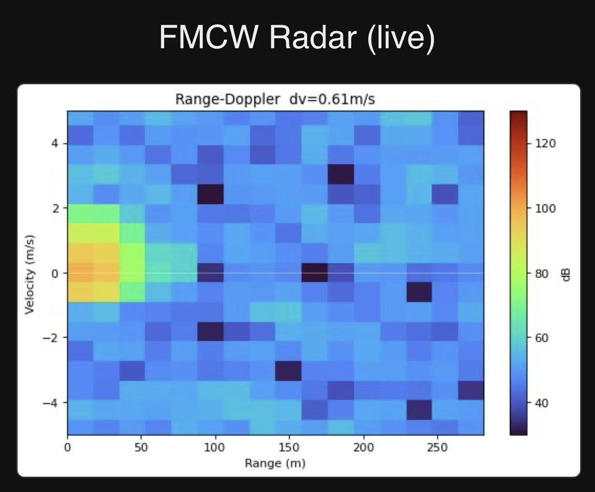
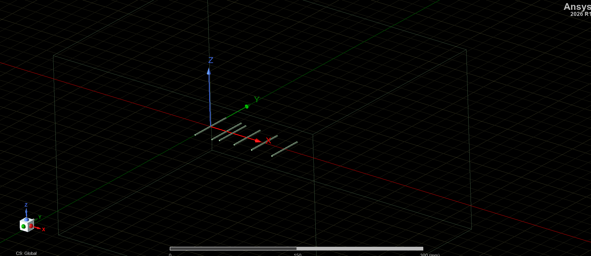
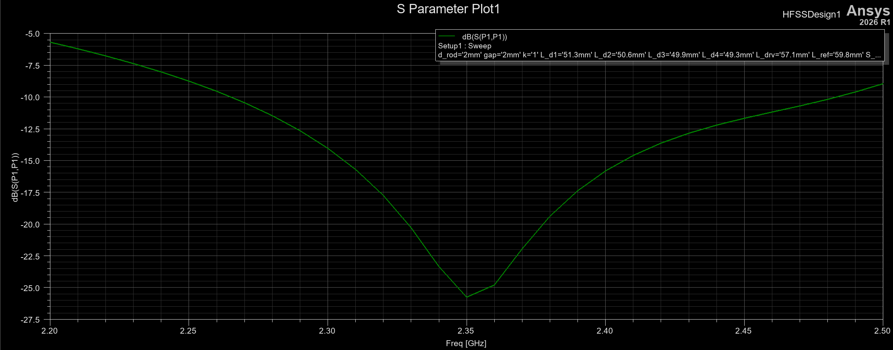
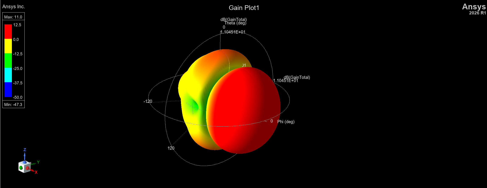
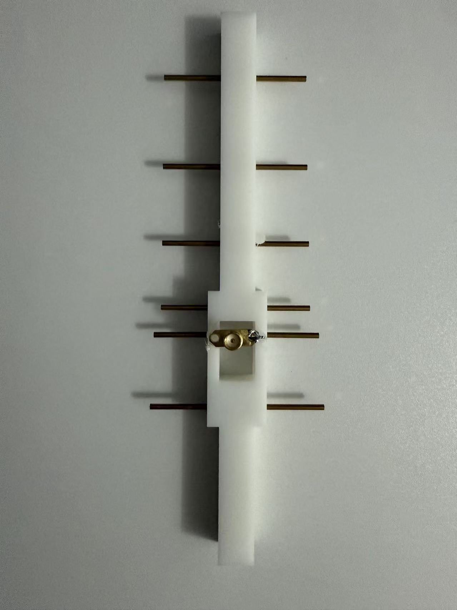
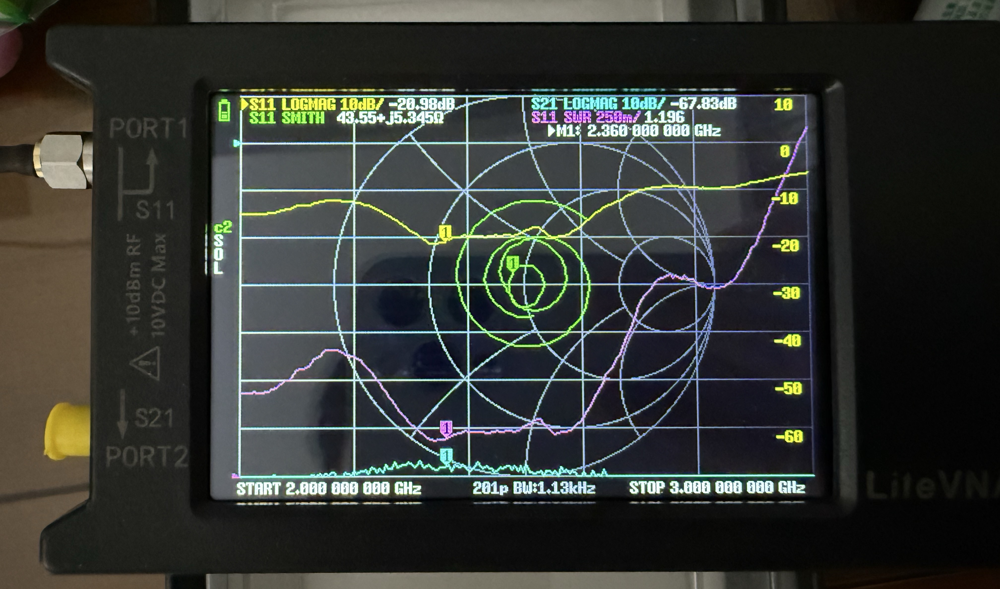
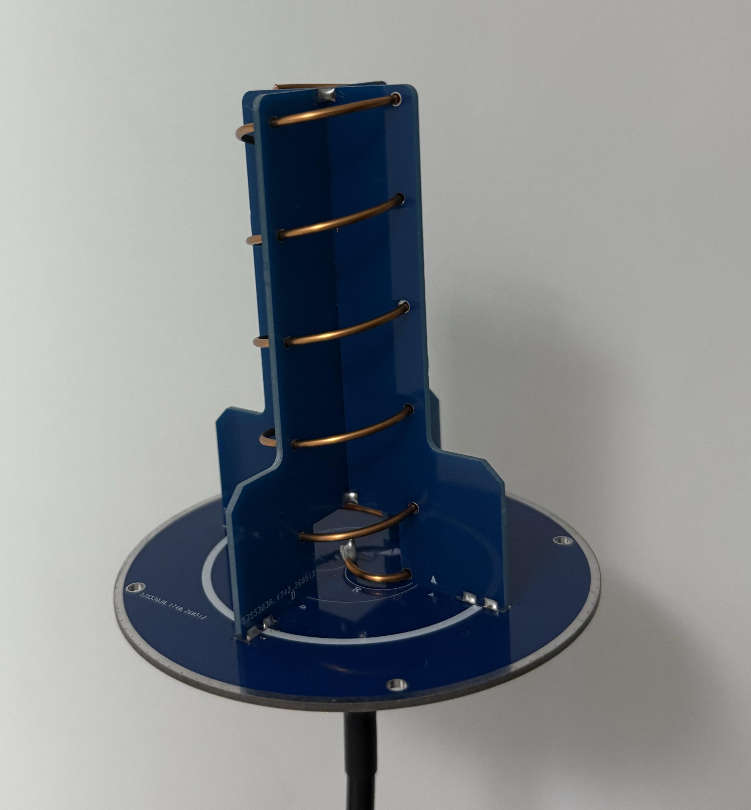

# pluto-fmcw-radar
A short-range FMCW radar built around a custom PlutoSDR with two self-designed Yagi antennae. The system generates a linear frequency modulated chirp, transmits and receives through the antennae, and processes the returns in Python to produce range and range Doppler maps. A Pi 4B is included to run the python script and publishes the result online to avoid moving computers.

Currently the dechirp step is done by the Pi 4B, and the sample rate is limited by the Ethernet cable. I'm trying to move the dechirp into the custom PlutoSDR's on-board FPGA (Zynq 7020) to push toward wider bandwidth (target 60 MHz, the maximum sample rate of AD9361).

Vivado 2022.2 source code of this custom PlutoSDR.
https://github.com/Xiaozhang-code-cloud/Fish-Wan-plutosdr-fw-7020-SDR.git

## System Overview

| | |
|---|---|
| **SDR** | ADALM-PlutoSDR (integrated PA / LNA) — chirp generation and reception |
| **Carrier** | 2.35 GHz |
| **Bandwidth** | 10 MHz |
| **Waveform** | Linear-FM (LFM) chirp, FMCW |
| **Antenna** | Self-designed Yagi + a commercial circularly-polarized antenna |
| **Processing** | Python — dechirp, range FFT, range-Doppler FFT |

---

## Results

Range-Doppler map produced by Python at 10 MHz bandwidth. I was walking towards the radar 20 meters away. Due to the small sample rate the range resolution is not very good. The strong signal at the 1m/s block in the first column indicates a target.

---

## Custom Yagi Antenna

I designed the Yagi in ANSYS HFSS, fabricated it by hand, and verified it on a VNA. Measured performance agrees closely with simulation.

Design (HFSS)

HFSS model of the Yagi, designed for 2.35 GHz.

Simulated S11:−25 dB at 2.35 GHz.

Build & measurement

The fabricated antenna.

Measured S11: −20 dB at 2.35 GHz on the VNA — close agreement with the simulated result.

---

## Other Antennas

A commercial antenna. Since the reflected waves can be polarized in any directions, a circularly polarized antenna can maximize the signal.

---

## How It Works

1. Chirp generation — a linear-FM chirp is synthesized and transmitted through the PlutoSDR.
2. Reception — the reflected signal is captured on the receive chain.
3. Dechirp — the received signal is mixed with a reference chirp; the resulting beat frequency encodes target range.
4. Range-Doppler processing — a range FFT, followed by a Doppler FFT across successive chirps, produces the range-Doppler map, giving both distance and velocity.

---

## Next Steps

Moving the dechirp from the host into the PlutoSDR's FPGA so the full bandwidth can be processed on-board, working toward 60 MHz.

